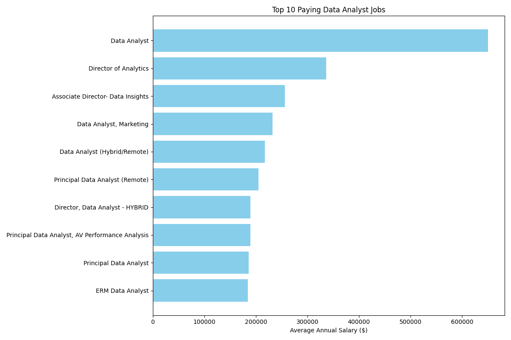
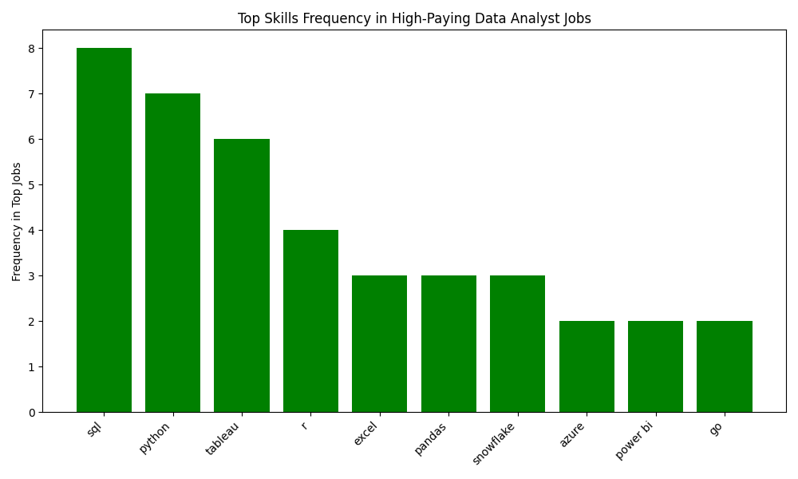
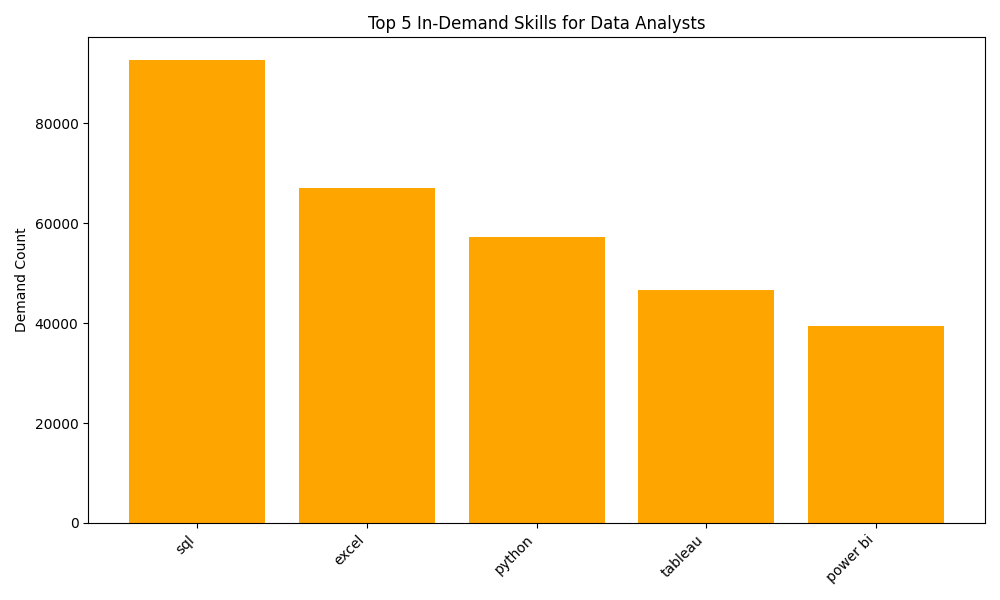
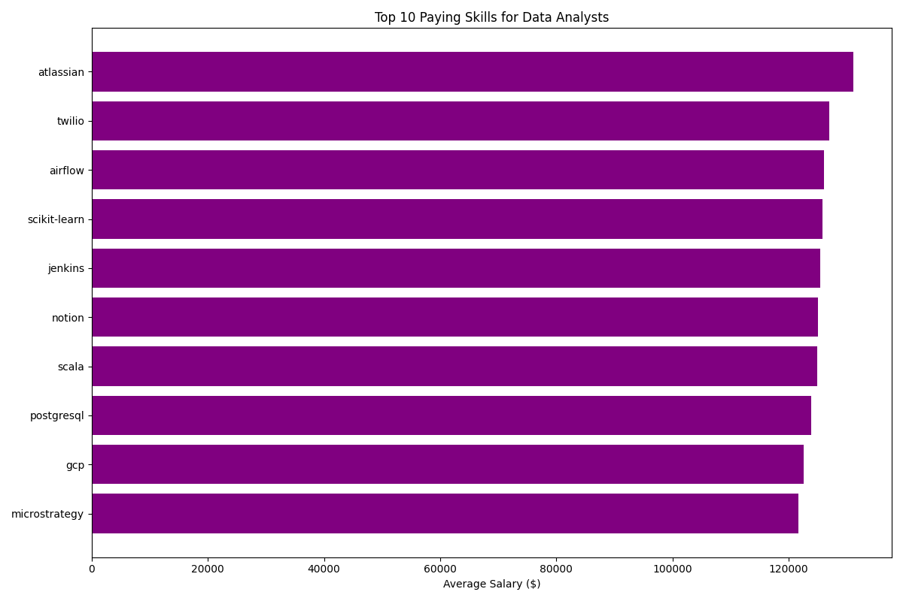
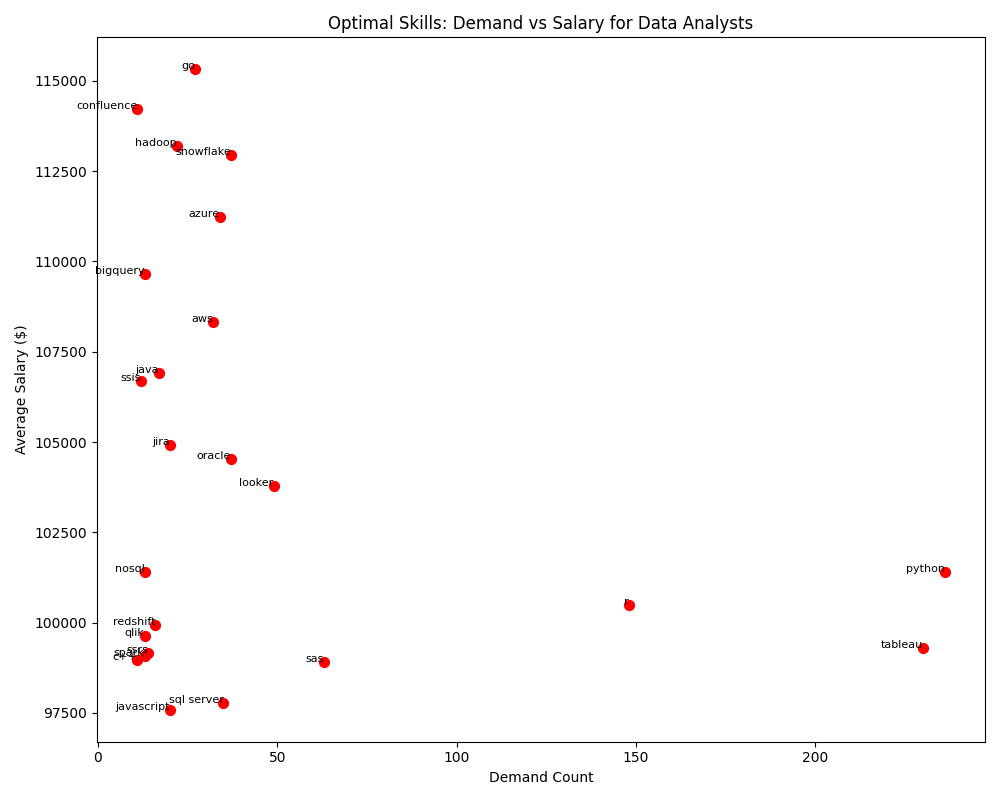

# Data Analyst Job Market Analysis

## Introduction
This project analyzes the job market for Data Analyst roles, focusing on high-paying opportunities and the skills required to secure them. By leveraging SQL queries on a comprehensive job postings dataset, this project identifies top-paying jobs, in-demand skills, and optimal skills for career growth. The analysis targets roles in Toronto, Canada, and remote positions, providing actionable insights for job seekers and career planners in the data analytics field.

## Background
The data analytics field is rapidly evolving, with increasing demand for professionals skilled in data processing, visualization, and communication. Understanding which roles offer the highest salaries and the skills associated with them is critical for job seekers aiming to maximize their career potential. This project was developed to provide a data-driven approach to answering key questions about the Data Analyst job market, such as:
- What are the highest-paying Data Analyst jobs?
- Which skills are most in demand?
- Which skills correlate with higher salaries?
- What are the optimal skills to learn for both demand and pay?

The dataset includes job postings, company details, and associated skills, enabling a detailed analysis of market trends.

## Tools Used
- **SQL**: For querying and analyzing the job postings dataset.
- **PostgreSQL**: Database management system used to store and query data.
- **Python**: Used for data processing and visualization (pandas, matplotlib).
- **JSON**: Format for storing query results for further analysis or visualization.
- **Git**: Version control for managing project files and collaboration.
- **GitHub**: Hosting platform for the project repository.

## Dataset
The dataset consists of three main tables:
- **job_postings_fact**: Contains job details such as job ID, title, location, schedule type, salary, and posting date.
- **company_dim**: Provides company information linked to job postings.
- **skills_job_dim** and **skills_dim**: Map skills to job postings, detailing required technical and soft skills.

## Setup and Usage
To reproduce the analysis and visualizations:
1. **SQL Queries**: Run the SQL scripts in `project_sql/` using a PostgreSQL database with the dataset loaded.
2. **Visualizations**:
   - Ensure Python 3.x is installed with `pandas`, `matplotlib`, and `numpy` (`pip install pandas matplotlib numpy`).
   - Run the Python scripts in `visualizations/` to generate the PNG files.
   - Scripts load JSON results directly and output images to `visualizations/`.
3. **View Results**: JSON results are stored in `project_result_json/` for reference.

## The Analysis
The analysis is divided into five key questions, each addressed with a specific SQL query and summarized below. Full queries are available in the `project_sql` directory, with results in `project_result_json` and visualizations in `visualizations`.

### 1. Top-Paying Data Analyst Jobs
**Objective**: Identify the top 10 highest-paying Data Analyst roles in Toronto or remote locations with specified salaries.
- **Key Findings**:
  - Top-paying roles include titles like "Data Analyst," "Director of Analytics," and "Principal Data Analyst."
  - Salaries range from $184,000 to $650,000 annually, with companies like Mantys, Meta, and AT&T leading.
  - Most roles are remote and full-time, highlighting the demand for flexible work arrangements.
- **Query**: [1_top_paying_jobs.sql](project_sql/1_top_paying_jobs.sql)
- **Results**: [1_top_paying_jobs_result.json](project_result_json/1_top_paying_jobs_result.json)
- **Visualization**: Bar chart showing salaries by job title.  
  

### 2. Skills for Top-Paying Data Analyst Jobs
**Objective**: Determine the skills required for the top 10 highest-paying Data Analyst roles.
- **Key Findings**:
  - SQL is universally required across all top-paying roles.
  - Python and Tableau are the top complementary skills.
  - Cloud platforms (Azure, AWS, Snowflake, Databricks) are common in senior roles.
  - Collaboration tools (Git, Jira, Confluence) and visualization tools (Power BI, PowerPoint) are critical for senior/principal positions.
- **Query**: [2_top_paying_job_skills.sql](project_sql/2_top_paying_job_skills.sql)
- **Results**: 
  - [2_top_paying_job_skills_approach_1_result.json](project_result_json/2_top_paying_job_skills_approach_1_result.json)
  - [2_top_paying_job_skills_approach_2_result.json](project_result_json/2_top_paying_job_skills_approach_2_result.json)
- **Visualization**: Bar chart of skill frequency in top roles.  
  

### 3. Most In-Demand Skills for Data Analysts
**Objective**: Identify the top 5 most in-demand skills for Data Analyst roles.
- **Key Findings**:
  - SQL (92,628 postings) and Excel (67,031 postings) are the most sought-after skills.
  - Python (57,326), Tableau (46,554), and Power BI (39,468) follow, emphasizing the importance of programming and visualization.
- **Query**: [3_top_demanded_skills.sql](project_sql/3_top_demanded_skills.sql)
- **Results**: [3_top_demanded_skills_result.json](project_result_json/3_top_demanded_skills_result.json)
- **Visualization**: Bar chart of top 5 skills by job posting count.  
  

### 4. Top-Paying Skills for Data Analysts
**Objective**: Identify skills associated with the highest average salaries for remote Data Analyst roles.
- **Key Findings**:
  - Big data tools (PySpark: $208,172, Bitbucket: $189,155) and DevOps tools (GitLab: $154,500) command premium salaries.
  - Python libraries (Pandas: $151,821, NumPy: $143,513) and cloud platforms (GCP: $122,500) are highly valued.
  - Trends indicate a shift toward hybrid data engineering and analytics roles.
- **Query**: [4_top_paying_skills.sql](project_sql/4_top_paying_skills.sql)
- **Results**: [4_top_paying_skills_result.json](project_result_json/4_top_paying_skills_result.json)
- **Visualization**: Bar chart of skills with highest average salaries.  
  

### 5. Optimal Skills for High-Paying Data Analyst Roles
**Objective**: Identify skills that balance high demand and high salaries for remote Data Analyst roles.
- **Key Findings**:
  - Programming languages like Python (236 demand, $101,397) and R (148 demand, $100,499) are highly requested but offer moderate salaries.
  - Niche skills like Go (27 demand, $115,320), Snowflake (37 demand, $112,948), and Confluence (11 demand, $114,210) offer higher pay.
  - Cloud and database skills (Azure, AWS, Oracle) and visualization tools (Tableau, Looker) are critical for enterprise roles.
- **Query**: [5_optimal_skills.sql](project_sql/5_optimal_skills.sql)
- **Results**: [5_optimal_skills_result.json](project_result_json/5_optimal_skills_result.json)
- **Visualization**: Scatter plot balancing demand and salary for key skills.  
  

## Visualizations
Below are visualizations summarizing key findings from the analysis:
- **Top-Paying Data Analyst Jobs**: Bar chart showing salaries by job title.  
  
- **Skills for Top-Paying Jobs**: Bar chart of skill frequency in top roles.  
  
- **Most In-Demand Skills**: Bar chart of top 5 skills by job posting count.  
  
- **Top-Paying Skills**: Bar chart of skills with highest average salaries.  
  
- **Optimal Skills**: Scatter plot showing demand vs. salary for key skills.  
  

## What I Learned
- **SQL Proficiency**: Writing complex SQL queries with joins, CTEs, and aggregations to extract meaningful insights from large datasets.
- **Data Analysis**: Gained insights into job market trends, including the importance of combining technical and communication skills.
- **Skill Prioritization**: Identified high-value skills (e.g., PySpark, Snowflake, Confluence) that offer both demand and high salaries.
- **Career Insights**: Learned the importance of cloud platforms, big data tools, and collaboration tools in modern Data Analyst roles.
- **Data Visualization**: Developed professional visualizations using Python (pandas, matplotlib) to communicate insights effectively.

## Conclusions
This project provides a comprehensive analysis of the Data Analyst job market, highlighting top-paying roles, in-demand skills, and optimal skills for career growth. Key takeaways include:
- **Top-Paying Roles**: Remote and senior-level roles (e.g., Director, Principal Data Analyst) offer salaries up to $650,000, with companies like Mantys and Meta leading.
- **Critical Skills**: SQL, Python, and Tableau are foundational, while cloud platforms (Azure, AWS, Snowflake) and collaboration tools (Jira, Confluence) are increasingly vital.
- **Career Strategy**: Job seekers should prioritize widely demanded skills (SQL, Python, Tableau) for versatility and niche skills (Go, PySpark, Snowflake) for higher pay.
- **Market Trends**: The shift toward hybrid data engineering and analytics roles emphasizes the need for skills in big data processing and cloud platforms.

## Future Work
- **Expand Location Analysis**: Include additional cities or regions to compare salary and skill trends globally.
- **Time-Based Trends**: Analyze how skill demand and salaries evolve over time using job posting dates.
- **Advanced Visualizations**: Develop interactive dashboards (e.g., using Tableau or Power BI) to visualize findings for broader accessibility.
- **Skill Combinations**: Investigate which combinations of skills (e.g., Python + Snowflake) yield the highest salaries.

## Repository Structure
```
├── project_sql/                     # SQL queries for analysis
│   ├── 1_top_paying_jobs.sql
│   ├── 2_top_paying_job_skills.sql
│   ├── 3_top_demanded_skills.sql
│   ├── 4_top_paying_skills.sql
│   ├── 5_optimal_skills.sql
├── project_result_json/             # JSON results for each query
│   ├── 1_top_paying_jobs_result.json
│   ├── 2_top_paying_job_skills_approach_1_result.json
│   ├── 2_top_paying_job_skills_approach_2_result.json
│   ├── 3_top_demanded_skills_result.json
│   ├── 4_top_paying_skills_result.json
│   ├── 5_optimal_skills_result.json
├── visualizations/                  # Visualization scripts and output images
│   ├── top_paying_jobs.py
│   ├── top_paying_job_skills_freq.py
│   ├── top_demanded_skills.py
│   ├── top_paying_skills.py
│   ├── optimal_skills_scatter.py
│   ├── top_paying_jobs.png
│   ├── top_paying_job_skills_freq.png
│   ├── top_demanded_skills.png
│   ├── top_paying_skills.png
│   ├── optimal_skills_scatter.png
├── README.md                       # Project documentation
```

## Contact
For questions or feedback, please open an issue on this GitHub repository or email me at `esterabimobina@gmail.com`.